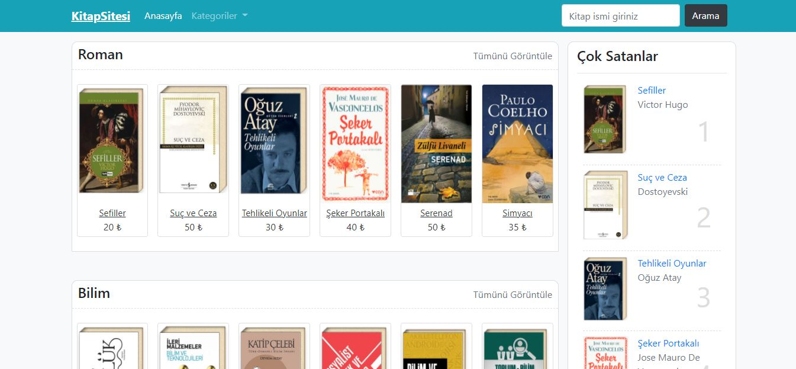
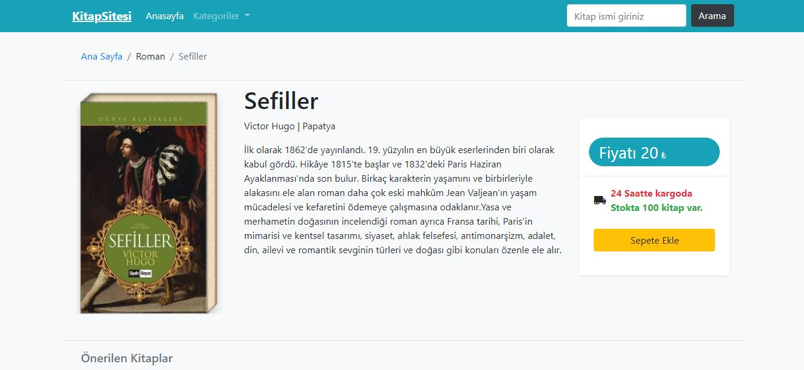
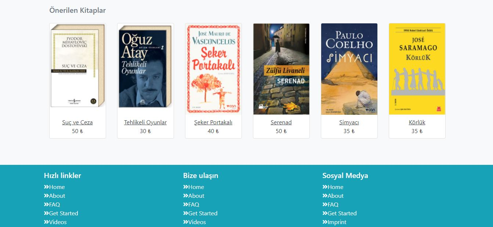
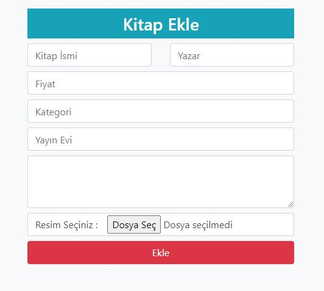

# KitapSitesi

## Installation

```
$ git clone https://github.com/SedatBasaran14/ReactBlog.git
$ cd ReactBlog
```
### `npm start`

Runs the app in the development mode.\
Open [http://localhost:3000](http://localhost:3000) to view it in the browser.

The page will reload if you make edits.\
You will also see any lint errors in the console.

## The goal of the project
I prepared a book website. I have saved the data in database 'MySql'. I created a "/kitapekle" section to be able to add a new book. I have used it for categorizing and searching in MySql. Search part is actively running.


### HomePage



### Card Page


 
### Proposal Page



### Add Page


